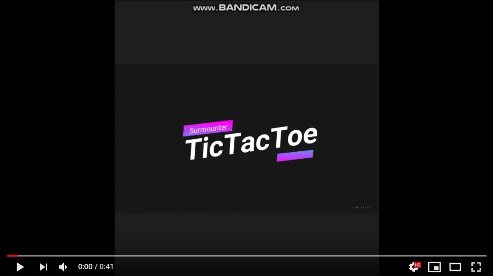

# BiweeklyGame

# TicTacToe

* 제작인원 : 1인
* 사용언어 : C++
* 사용라이브러리 : SFML
* [포트폴리오 및 코드설명](https://github.com/surmounter/BiweeklyGame/blob/master/TicTaeToc/ReadMe.md)
* [피드백 노트](https://github.com/surmounter/BiweeklyGame/blob/master/TicTaeToc/Feedback.md)

